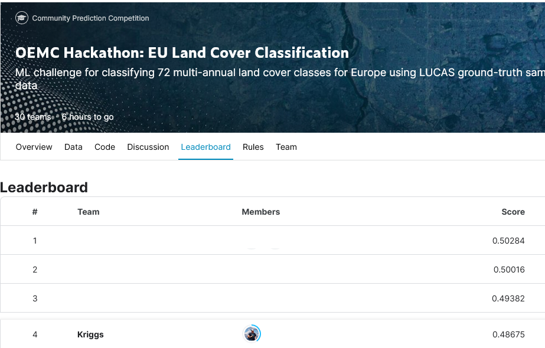

# OEMC Hackathon: EU Land Cover Classification

This repository contains the code I developed to predict the land cover of Europe for a competition.  
The data consists of 416 numerical features and 72 different labels, with 42237 samples.

I used Pandas, Numpy and SKLearn for the data manipulation, and TensorFlow for the Machine Learning model - other SKLearn models were tested but didn't yield good results.

As of the time of writing this page, this code scored 0.48018 (weighted F1 score), granting a 4th place in the competition.

# What worked

During my trials in this competition there was a lot of learning, for this particular Dataset, the following techniques were the most helpful:

- Data Transformation Normalization and Outlier detection - The data was very skewed with many outliers and input errors, I was selecting and transforming the data feature by feature, but comparing my work with SKLearns PowerTransform it became clear that the former was enough to get a high score, if this were a longer project, manually reviewing the data would yield a better result
- PCA Tranformation - didn't granted a higher score, but by reducing the dimensionality (from 416 to 250 with same score) I was able to run more tests in less time
- Stratifiyng the Train/Validation Data - As this Dataset has a very uneven distribution of labels, it helped by splitting the train and validation dataset with enough data for each label
- Cross-validation - The local validation results were consistently going up with the test submission results - this indicates a good train/test data selection by the organizers part
- TensorFlow
  - The hyperparametrization of TensorFlow is very vast, many was tested but I got the better results with few layers (3), and a combination of Sigmoid and ReLu layers.
  - Small batch sizes tented to overfit after few epochs (~5), big batch sizes didn't converged to a good score, but a combination of starting with small batch sizes then incresing the size would yield a good generalization
  - Bigger models were very fast to overfit
  - The target variable, had to be set as a float for better accuracy
  - The optimizers learning rate had great effects on the score, but a search with Optuna resulted in the default value being the best

# What didn't worked

- RandomForestClassifiers were very fast to overfit - prunning and hyperparametrization reduced overfitting but also the F1 Score
- XGBoost took a long time to classify, and as so the hypermatrization was limited
  - [Fabian Henning](https://www.kaggle.com/code/crustacean/xgboost-hyper-parameter-tuning-optuna) posted a Notebook with his hyperparametrization of XGBoost with Optuna, but I had better results with all default values
- Manual feature selection - Considering the size of the Dataset (416 features), and the time allocated for this project, the manual selection and engineering of features was too time consuming and yielded every so small margins, therefore all transformations were done with SKLearns preprocessing for convenience
- Automatic feature selection - RFE (Recursive feature elimination) and RFC feature importance were tested but also didn't yield better results
- Other Scalers - MinMaxScaler, StandardScaler, MaxAbsScaler a few others were tested but all yielded worse results than PowerScaler
- Feature Engineering - PolynomialFeatures and manual feature enginering like columns multiplication, summing, aggregation, didn't yielded good results

Source for the competition and dataset:  
https://www.kaggle.com/competitions/oemc-hackathon-eu-land-cover-classification/leaderboard